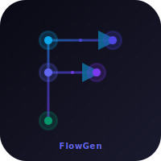

<div align="center">
  
  <h1>FlowGen</h1>
  <p><strong>Describe any architecture. Get an interactive diagram instantly.</strong></p>

  <p>
    
    
    
    
    
  </p>
</div>

---

FlowGen turns natural language into interactive architecture diagrams. Type a description, get a fully laid-out, color-coded, animated flow diagram — no drag-and-drop, no manual wiring.

Built with React Flow, AWS Bedrock (Amazon Nova Pro), and dagre auto-layout.

## Demo

https://github.com/user-attachments/assets/0cf87c62-7324-4805-8f85-5bb0f6888f47

## Features

**Natural language → diagram**
Describe microservices, CI/CD pipelines, event-driven systems, auth flows — anything with nodes and edges. The LLM returns structured JSON; dagre handles the layout.

**Iterative refinement**
After generating a diagram, use the refine input to evolve it: *"add a Redis cache between the API and the database"*, *"make the Kafka connection async"*. The full conversation history is forwarded to the model.

**Async/sync edge detection**
The LLM automatically detects asynchronous communication patterns (message queues, events, webhooks, callbacks) and marks edges with a distinctive double-dashed style and amber "(async)" label. Synchronous request-response flows remain solid or single-dashed.

**Architecture feedback & warnings**
AI-powered analysis identifies potential production risks, anti-patterns, and best practice violations:
- **Critical**: Single points of failure, missing error handling, data loss risks
- **Warning**: Missing retry logic, tight coupling, async without proper handling
- **Info**: Suggestions for monitoring, circuit breakers, caching

Each warning includes a **one-click "Apply Fix"** button that automatically generates a refined diagram addressing the issue.

**Prompt history tracking**
Every prompt used to create or refine a diagram is stored with timestamps. View the full evolution of your architecture with the "History" panel.

**Instant templates**
Five pre-built architectures load in zero milliseconds — no model call needed. Use them as starting points or reference.

| Template | What it shows |
|---|---|
| Microservices | API gateway, auth, user & order services, PostgreSQL |
| Event-Driven | Producer → Kafka → multiple consumers |
| CI/CD Pipeline | Git push through build, test, registry, staging, prod |
| 3-Tier Web App | CDN, load balancer, API servers, Redis, database |
| OAuth 2.0 Flow | Authorization code flow with identity provider |

**Node detail panel**
Click any node to open a slide-in panel showing the component description, tech stack options (context-aware), and its connections.

**Export options**
- **PNG**: One-click export of the full canvas at 2× resolution
- **JSON**: Export complete diagram data for use with LLM tools to start implementation (tooltip: "Start building!")

**Configurable warnings**
Toggle architecture feedback on/off with the "Feedback On/Off" button. Disabling warnings speeds up generation and reduces token usage.

## Getting started

### Prerequisites

- Node.js 18+
- An AWS account with Bedrock access
- `amazon.nova-pro-v1:0` model enabled in your region ([request access](https://console.aws.amazon.com/bedrock/home#/modelaccess))

### Install

```bash
git clone https://github.com/your-username/flow-diagram-gen
cd flow-diagram-gen
npm install
```

### Configure

Create a `.env` file at the project root:

```env
VITE_AWS_REGION=us-east-1
VITE_BEDROCK_MODEL_ID=amazon.nova-pro-v1:0
```

The app uses the AWS SDK default credential chain — no hardcoded keys needed. Make sure your credentials are configured:

```bash
aws configure
# or set AWS_ACCESS_KEY_ID / AWS_SECRET_ACCESS_KEY environment variables
```

### Run

```bash
npm run dev
```

Open [http://localhost:5173](http://localhost:5173).

## How it works

```
User prompt
    │
    ▼
Vite dev server middleware
    │  forwards to
    ▼
AWS Bedrock (Amazon Nova Pro)
    │  streams JSON via SSE
    ▼
partial-json live parser
    │  as chunks arrive
    ▼
dagre auto-layout
    │  positions nodes
    ▼
React Flow canvas
```

The system prompt instructs the model to return only a JSON object with `nodes` and `edges`. `x/y` coordinates are ignored — dagre computes the layout client-side. Partial JSON is parsed on every chunk so nodes appear as the stream arrives.

For iterative refinement, the full message history (`user`/`assistant` turns) is forwarded to Bedrock's `messages` array, giving the model context of the previous diagram when applying changes.

## Tech stack

| Layer | Technology |
|---|---|
| UI framework | React 19 + TypeScript |
| Diagram rendering | React Flow 11 |
| Auto-layout | dagre |
| Animation | Framer Motion |
| LLM | AWS Bedrock — Amazon Nova Pro |
| Streaming | Server-Sent Events (SSE) |
| Partial JSON | partial-json |
| Build tool | Vite 8 |
| Styling | Tailwind CSS v4 |
| Export | html-to-image |

## Node color convention

| Color | Meaning |
|---|---|
| `#0EA5E9` blue | Clients, browsers, users |
| `#DC2626` red | Gateways, load balancers, proxies |
| `#4F46E5` indigo | Internal services |
| `#D97706` amber | Queues, message brokers, caches |
| `#059669` green | Databases, storage, sinks |

Edge style: **solid** = synchronous, **dashed** = async/event-driven, **double-dashed with amber label** = asynchronous communication (auto-detected). Animated edges indicate active data flow.

## Project structure

```
src/
├── components/
│   ├── InputPane.tsx        # Prompt input + refine mode
│   ├── DiagramPane.tsx      # Canvas container + export + warnings toggle
│   ├── FlowCanvas.tsx       # React Flow graph with async edge styling
│   ├── CustomNode.tsx       # Color-coded nodes with smart icons
│   ├── NodeDetailPanel.tsx  # Slide-in node inspector
│   ├── PromptHistory.tsx    # Prompt history timeline panel
│   ├── WarningsPanel.tsx    # Architecture feedback panel with Apply Fix
│   └── TemplateGallery.tsx  # Pre-built diagram templates
├── hooks/
│   ├── useDiagramGeneration.ts  # Generation state + message history + warnings toggle
│   └── useStaggeredReveal.ts    # Node entrance animation
└── lib/
    ├── prompt.ts            # LLM system prompt with warnings analysis
    ├── bedrock.ts           # SSE streaming client
    ├── layout.ts            # dagre auto-layout
    ├── export.ts            # PNG + JSON export
    ├── templates.ts         # Pre-built diagram schemas
    ├── techSuggestions.ts   # Node tech stack hints
    └── types.ts             # TypeScript interfaces (warnings, prompt history)
```
